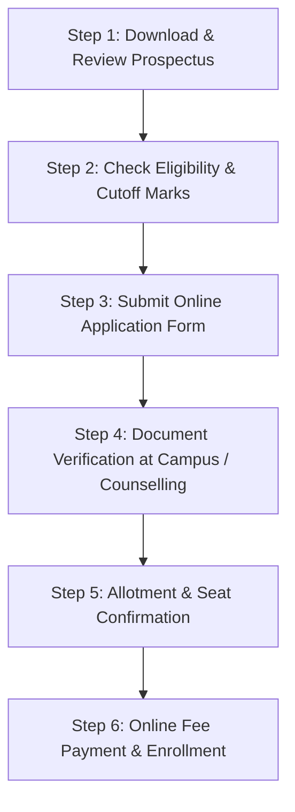

# Mohamed Sathak A.J. College of Engineering (MSAJCE)
## Comprehensive Admission & Procedure Guide (2026-2027)

> **Autonomous Institution | NAAC Accredited | AICTE Approved | Affiliated to Anna University**  
> **TNEA Counselling Code:** `1301`  
> **Campus Location:** Inside SIPCOT IT Park, Egattur, Siruseri, Chennai – 603103, Tamil Nadu  

---

## 1. Overview & Official Document Datasets

This comprehensive guide compiles all verified dataset information, course offerings, seat matrices, cutoff rules, qualification guidelines, document checklists, and application procedures for admissions at **Mohamed Sathak A.J. College of Engineering (MSAJCE)**.

### Primary Referenced Dataset Documents in Workspace
- **Official College Prospectus & Brochure (PDF):** [`public/uploads/admission/College-Prospectus.pdf`](file:///c:/Users/niran/Downloads/clg%20v1/academic_revival_repo/public/uploads/admission/College-Prospectus.pdf) (77.2 MB) & `https://msajce-edu.in/uploads/admission/brochure_2026.pdf`
- **Admissions & Academics Dataset:** [`_raw_data/college datas/MSAJCE_Markdown_Files/MSAJCE_Admissions_and_Academics_17_Pages_batch1_.md`](file:///c:/Users/niran/Downloads/clg%20v1/academic_revival_repo/_raw_data/college%20datas/MSAJCE_Markdown_Files/MSAJCE_Admissions_and_Academics_17_Pages_batch1_.md)
- **Extracted College Core Data:** [`_raw_data/college_datas_extracted.txt`](file:///c:/Users/niran/Downloads/clg%20v1/academic_revival_repo/_raw_data/college_datas_extracted.txt) & [`_raw_data/content_summary.md`](file:///c:/Users/niran/Downloads/clg%20v1/academic_revival_repo/_raw_data/content_summary.md)
- **Programmes & Course Master Catalog:** [`src/lib/courseData.ts`](file:///c:/Users/niran/Downloads/clg%20v1/academic_revival_repo/src/lib/courseData.ts)
- **Application Portal:** [Online Application Form](https://msajce-edu.in/admission_form.php)
- **Fee Payment Portal:** [Online Fee Payment](https://msajce-edu.in/feepayment.php)

---

## 2. Programmes Offered & Seat Allocation Matrix

### A. Undergraduate Degree Programmes (B.E. / B.Tech / B.Arch / B.Des)

| Programme Name | Level | Duration | Total Intake | Govt Quota (50%) | Management Quota (50%) |
| :--- | :--- | :--- | :---: | :---: | :---: |
| **B.E. Computer Science and Engineering** | UG | 4 Years (8 Sems) | **120** | 60 | 60 |
| **B.Tech. Information Technology** | UG | 4 Years (8 Sems) | **60** | 30 | 30 |
| **B.Tech. Artificial Intelligence & Data Science** | UG | 4 Years (8 Sems) | **60** | 30 | 30 |
| **B.Tech. Computer Science & Business Systems** | UG | 4 Years (8 Sems) | **60** | 30 | 30 |
| **B.E. CSE (Cyber Security)** | UG | 4 Years (8 Sems) | **60** | 30 | 30 |
| **B.E. CSE (Artificial Intelligence & Machine Learning)** | UG | 4 Years (8 Sems) | **60** | 30 | 30 |
| **B.E. Electronics and Communication Engineering** | UG | 4 Years (8 Sems) | **60** | 30 | 30 |
| **B.E. Electronics Engg. (VLSI Design & Technology)** | UG | 4 Years (8 Sems) | **30** | 15 | 15 |
| **B.E. ECE (Advanced Communication Technology)** | UG | 4 Years (8 Sems) | **30** | 15 | 15 |
| **B.E. Electrical and Electronics Engineering** | UG | 4 Years (8 Sems) | **30** | 15 | 15 |
| **B.E. Mechanical Engineering** | UG | 4 Years (8 Sems) | **30** | 15 | 15 |
| **B.E. Civil Engineering** | UG | 4 Years (8 Sems) | **30** | 15 | 15 |
| **Bachelor of Architecture (B.Arch)** | UG | 5 Years (10 Sems) | **40** | 20 | 20 |
| **Bachelor of Design (B.Des)** | UG | 4 Years (8 Sems) | **30** | 15 | 15 |

### B. Postgraduate Degree Programmes (M.E. / M.Arch)

| Programme Name | Level | Duration | Sanctioned Intake | Entry Route |
| :--- | :--- | :--- | :---: | :--- |
| **M.E. Computer Science and Engineering** | PG | 2 Years (4 Sems) | **18** | TANCET / CEETA-PG / GATE |
| **M.E. Structural Engineering** | PG | 2 Years (4 Sems) | **18** | TANCET / CEETA-PG / GATE |
| **M.E. VLSI Design** | PG | 2 Years (4 Sems) | **18** | TANCET / CEETA-PG / GATE |
| **M.E. Power Systems Engineering** | PG | 2 Years (4 Sems) | **18** | TANCET / CEETA-PG / GATE |
| **M.E. Manufacturing Engineering** | PG | 2 Years (4 Sems) | **18** | TANCET / CEETA-PG / GATE |
| **Master of Architecture (M.Arch)** | PG | 2 Years (4 Sems) | **15** | TANCET / CEETA-PG / GATE |

### C. Doctoral Studies (Ph.D. Research)
- **Mechanical Engineering Recognized Research Centre** (Approved by Anna University, Chennai).

---

## 3. Eligibility Criteria & Cutoff Standards

### A. First Year B.E. / B.Tech (HSC Academic Stream)
Candidates must have passed 10+2 / HSC (Academic) or equivalent examination with **Physics, Chemistry, and Mathematics (PCM)** as compulsory subjects.

| Community / Category | Minimum Average PCM Cutoff % |
| :--- | :---: |
| **General Category (OC)** | **45.00%** |
| **Backward Class (BC / BCM)** | **40.00%** |
| **Most Backward Class (MBC / DNC)** | **40.00%** |
| **Scheduled Caste (SC / SCA / ST)** | **40.00%** |

### B. First Year B.E. / B.Tech (HSC Vocational Stream)
Candidates must have passed 10+2 / HSC (Vocational) with one related engineering subject (Mathematics, Physics, or Chemistry).

| Community / Category | Minimum Average Cutoff % |
| :--- | :---: |
| **General Category (OC)** | **45.00%** |
| **BC / BCM / MBC / DNC / SC / ST** | **40.00%** |

### C. Direct Second Year (Lateral Entry - B.E. / B.Tech)
- **Option 1 (Diploma Candidates):** Passed 3-year Diploma in Engineering/Technology from the State Board of Technical Education and Training (DOTE), Tamil Nadu, or equivalent.
- **Option 2 (B.Sc. Candidates):** Passed recognized B.Sc. Degree (minimum 3 years, 10+2+3 pattern) with core Mathematics at degree level.

| Community / Category | Minimum Cutoff Criteria |
| :--- | :--- |
| **General Category (OC)** | **55.00%** aggregate in qualifying Diploma / B.Sc. |
| **Backward Class (BC / BCM)** | **50.00%** aggregate in qualifying Diploma / B.Sc. |
| **Most Backward Class (MBC / DNC)** | **45.00%** aggregate in qualifying Diploma / B.Sc. |
| **Scheduled Caste (SC / SCA / ST)** | **Pass Mark** in qualifying Diploma / B.Sc. exam |

### D. Postgraduate (M.E. / M.Arch) Admission Criteria
- Recognized Bachelor’s degree (B.E. / B.Tech / B.Arch) in the appropriate branch with minimum 50% marks (45% for reserved categories).
- Valid score in **TANCET (Tamil Nadu Common Entrance Test)** / **CEETA-PG** conducted by Anna University, or a valid **GATE** score.

### E. Special Categories (NRI & Sports Quota)
- **NRI Quota:** 5% of total approved intake is reserved for NRI / NRI-sponsored candidates. Unfilled NRI seats are converted to general merit candidates.
- **Sports Quota:** Concessions and scholarships provided for District, State, and National level sports participants across athletics, football, cricket, basketball, and martial arts.

---

## 4. Step-by-Step Admission Procedure

### Detailed Execution Steps:
1. **Brochure Review:** Download the official [Admission Brochure & Guidelines 2026-2027](https://msajce-edu.in/uploads/admission/brochure_2026.pdf) or view the local copy at [`public/uploads/admission/College-Prospectus.pdf`](file:///c:/Users/niran/Downloads/clg%20v1/academic_revival_repo/public/uploads/admission/College-Prospectus.pdf).
2. **Path Selection (Counselling vs. Direct Management Quota):**
   - **Government Quota:** Register for **TNEA Single Window Counselling** using **TNEA College Code: 1301**. Select MSAJCE during choice filling.
   - **Management Quota:** Apply directly through the college website or visit the Admission Office.
3. **Application Submission:** Fill in candidate personal, academic, and contact details on the [Online Application Portal](https://msajce-edu.in/admission_form.php).
4. **Document Verification:** Submit required certificates for physical verification at the college admission office.
5. **Fee Payment & Confirmation:** Complete fee payment through the secure [Online Fee Payment Portal](https://msajce-edu.in/feepayment.php) to confirm seat allocation.

---

## 5. Checklist of Required Documents for Admission

Candidates must produce the original certificates along with 3 sets of self-attested photocopies during admission:

### For Undergraduate (B.E. / B.Tech) First Year & Lateral Entry:
1. **10th Standard / SSLC Mark Sheet** (Proof of Date of Birth)
2. **11th Standard Mark Sheet** (where applicable)
3. **12th Standard / HSC Mark Sheet** / Equivalent Statement of Marks
4. **Diploma Mark Sheets & Provisional Certificate** (for Lateral Entry candidates)
5. **Transfer Certificate (TC)** and Conduct Certificate from the last studied institution
6. **Permanent Community Certificate** (Card Format issued by Competent Authority for BC, BCM, MBC, DNC, SC, SCA, ST)
7. **TNEA Allotment Order** (for Government Quota candidates)
8. **Nativity Certificate** (in electronic format, if applicable)
9. **First Graduate Certificate & Joint Declaration** (if claiming TN First Graduate Fee Concession)
10. **Income Certificate** (issued by Revenue Authorities for scholarship applicants)
11. **Migration Certificate** (for candidates from CBSE, ICSE, or Other State Boards)
12. **Aadhaar Card Copy** & Passport-size Photographs (6 copies)

### For Postgraduate (M.E.) Candidates:
1. **Undergraduate B.E. / B.Tech / B.Arch Degree Certificate / Provisional Certificate**
2. **All Semester Consolidated Mark Sheets**
3. **TANCET / CEETA-PG / GATE Hall Ticket & Score Card**
4. **10th & 12th Mark Sheets**
5. **Transfer Certificate & Migration Certificate**
6. **Community Certificate & Income Certificate**

---

## 6. Scholarship Schemes & Financial Assistance

| Scholarship Scheme | Funding Agency / Category | Eligibility Criteria | Financial Benefit |
| :--- | :--- | :--- | :--- |
| **Pragati Scholarship** | AICTE (Girl Students) | Max 2 girl children per family; Family income < ₹8.00 Lakhs/yr | **₹50,000 / year** (800 TN slots) |
| **Saksham Scholarship** | AICTE (Specially-Abled) | Disability level ≥ 40%; Family income < ₹8.00 Lakhs/yr | **₹50,000 / year** (All eligible) |
| **Merit-cum-Means Scholarship** | Ministry of Minority Affairs | Min 50% marks; Family income < ₹2.50 Lakhs/yr | **Up to ₹20,000/yr tuition + ₹12,000 hosteller / ₹6,000 day scholar** |
| **Central Sector Scheme** | MHRD | Above 80th percentile in Class XII; Income < ₹8.00 Lakhs/yr | **₹10,000 / year** |
| **Labour Welfare Scholarship** | Ministry of Labour | Ward of registered Beedi/Mine/Cine worker; Income < ₹10,000/mo | **₹15,000 / year** |
| **TN First Graduate Concession** | Government of Tamil Nadu | First degree holder in family admitted via TNEA | **Tuition Fee Concession** |
| **SC / ST Post-Matric Scholarship** | Government of Tamil Nadu | SC/ST/SCA students; Family income < ₹2.50 Lakhs/yr | **Full Fee Waiver / Scholarship** |
| **BC / MBC Post-Matric Scholarship** | Government of Tamil Nadu | BC/MBC students; Family income < ₹2.00 Lakhs/yr | **Government Stipend & Fee Concession** |
| **Mohamed Sathak Trust Merit Scheme** | Mohamed Sathak Trust | High academic cutoff / National sports achievers | **Institutional Fee Concessions** |

---

## 7. Admission Office & Helpdesk Contact Information

For admission enquiries, campus visits, eligibility verification, or fee details:

- **Admission Officer:** Mr. A. Abdul Gafoor (Administrative Officer / Member)
- **Admission Helpdesk Phone:** +91 99400 04500 / 044-2747 0024 / +91 99400 04506
- **Admissions Email:** `admission@msajce-edu.in` / `msajce.office@gmail.com`
- **College Website:** [https://msajce-edu.in](https://msajce-edu.in)
- **Campus Address:**  
  Mohamed Sathak A.J. College of Engineering,  
  Inside SIPCOT IT Park, Egattur, Siruseri,  
  Chennai – 603103, Tamil Nadu, India.
